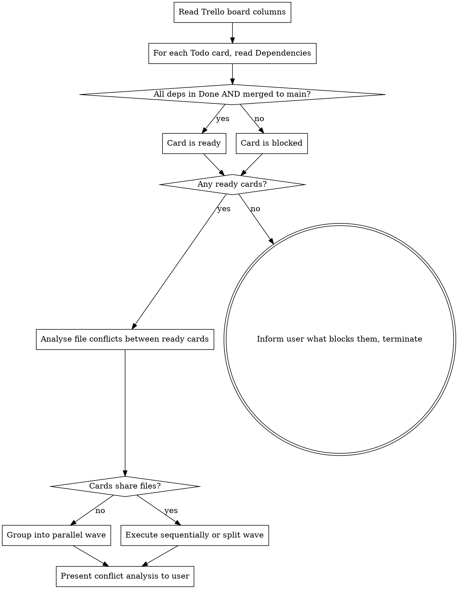
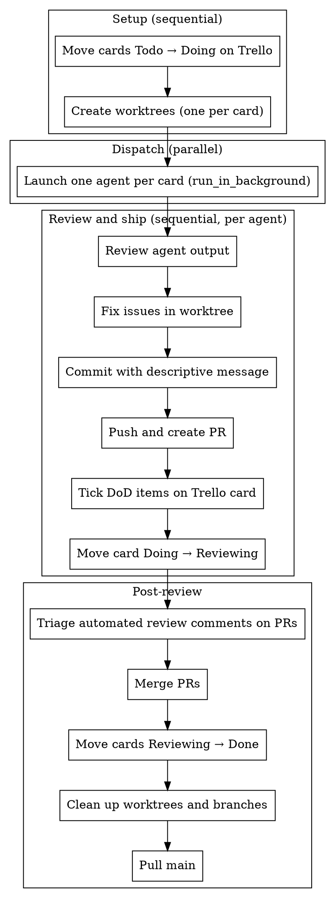

# Executing Trello Waves

Execute the next available wave of Trello implementation cards in parallel using git worktrees and subagents.

**Core principle:** Trello cards drive scope. One card = one worktree = one agent = one PR. The orchestrator (you) owns git, PRs, and Trello. Agents only write code.

**Dependency:** Load `trello-api` skill first (`/trello-api`).

## Before You Start

1. **Pull latest main:**
   ```bash
   git checkout main && git pull
   ```

2. **Load the Trello skill** — run `/trello-api` so you can query the board.

3. **Read repo docs** — `CLAUDE.md`, `AGENTS.md`, `CONTRIBUTING.md`, and any docs directory. These define how agents must work in this repo.

4. **Gather central context** — read key implementation files (models, services, CRUD, errors, clients, configs, tests). Include critical code **verbatim** in agent prompts rather than pointing to file paths — agents waste significant time re-reading files the orchestrator already has.

## Identify the Next Wave



**Dependency verification:** Cards can be "Done" on Trello with unmerged PRs. Verify with `git log` or `git branch -r` — treat unmerged dependencies as unmet.

**File conflict analysis:** For each ready card, list the files it will create or modify. Cards that share files cannot be parallelised — they will produce merge conflicts.

## Build Agent Prompts

Every agent prompt must include:

| Section | Content |
|---------|---------|
| **Worktree path** | Absolute path the agent must work in |
| **Shared context block** | Verbatim code for base classes, existing implementations the agent needs to call or follow, DI patterns |
| **File pointers** | `AGENTS.md`, `CONTRIBUTING.md`, architecture docs, relevant module READMEs — for reference if agent needs more detail |
| **Card context** | Full Trello card description (What, Why, Dependencies) and Definition of Done checklist items |
| **Quality gates** | Lint, type-check, and test commands appropriate for the project (e.g. `ruff format . && ruff check --fix`, `mypy .`, `pytest -m unit`) |
| **No git ops** | Agents must NOT commit, push, or create PRs — they write code and run quality gates only |

## Execute the Wave



### Worktree Creation

If the repo has `scripts/create-worktree.sh`, use it:
```bash
scripts/create-worktree.sh feat/<short-name>
```

Otherwise, create manually and let the agent set up the environment from project context:
```bash
git worktree add .worktrees/feat/<short-name> -b feat/<short-name>
```

### Review Checklist

When reviewing agent output, check for:

- **Architecture compliance** — services don't import HTTP concepts, routers don't contain logic, contracts follow repo conventions
- **Write-path completeness** — if the card creates or updates data, verify the full chain through all layers
- **Test coverage** — every business rule in the card's description has a corresponding test
- **Quality gates passing** — lint, type-check, tests all green

### PR Format

PR descriptions must follow the format in `CLAUDE.md` / `~/.claude/CLAUDE.md`. At minimum:
```
## What?
[From the Trello card]

## Why?
[From the Trello card]

## Changes
...

## Test Plan
- [ ] ...
```

### Worktree Cleanup

After merging:
```bash
git worktree remove .worktrees/feat/<short-name>
git branch -d feat/<short-name>
```

## Rules

| Rule | Why |
|------|-----|
| Cards define PR scope — implement everything in the Definition of Done | One card = one PR, no partial implementations |
| Never move a card to Done yourself — that happens after merge | Reviewing and Done are separate columns |
| Never alias the `trello.sh` path to a variable | Breaks the auto-approve hook |
| No comments before `trello.sh` in bash commands | Also breaks auto-approval |
| Architecture rules come from repo docs — follow them, don't reinvent | `AGENTS.md` and `docs/` are authoritative |
| Keep Trello updated promptly | Move cards between columns and tick checklist items as work progresses |
| When ready cards share files, don't parallelise them | Split the wave or execute conflicting cards sequentially |
| If no cards are ready, inform the user and terminate | Do not invent work |

## Common Mistakes

| Mistake | Fix |
|---------|-----|
| Dispatching agents without gathering shared context first | Read implementation files and include verbatim code in prompts |
| Treating "Done on Trello" as "merged to main" | Always verify with `git log` or `git branch -r` |
| Parallelising cards that touch the same files | Analyse file conflicts before grouping into a wave |
| Letting agents handle git operations | Agents write code only — orchestrator owns git, PRs, Trello |
| Skipping automated review comment triage | Check each PR for bot comments, reply with rationale, apply valid fixes |
| Moving cards straight to Done after PR creation | Cards go to Reviewing first, then Done after merge |
