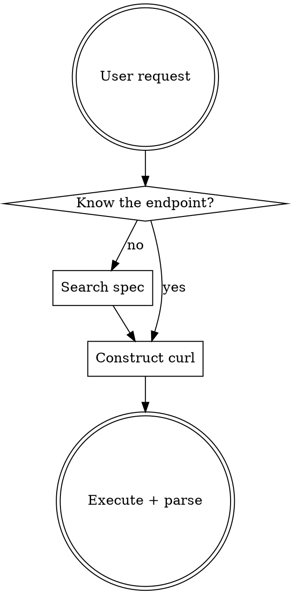

# Trello API

Invoke any of the 256 Trello REST API operations using curl, with the official OpenAPI spec cached locally and queried via jq.

## Setup

```bash
source ~/.zshrc
${CLAUDE_PLUGIN_ROOT}/scripts/spec-manager.sh ensure-spec
```

Run `ensure-spec` once per session. It downloads the spec on first use and checks for updates daily.

## Auth

All requests require API key and token as query params:

```
key=${TRELLO_API_KEY}&token=${TRELLO_TOKEN}
```

Base URL: `https://api.trello.com/1`

## Workflow



1. Run `ensure-spec` if not already done this session
2. If endpoint is unknown, use jq recipes below to find it
3. Construct curl command with auth params
4. Execute and parse response with `jq`

## Spec Queries

All queries use: `${CLAUDE_PLUGIN_ROOT}/scripts/spec-manager.sh query [jq-args...] '<expression>'`

**List API groups:**
```bash
spec-manager.sh list-groups
```

**List endpoints for a group:**
```bash
spec-manager.sh query --arg group "boards" \
  '.paths | to_entries[] | select(.key | startswith("/\($group)")) | .key as $path | .value | to_entries[] | select(.key == "parameters" | not) | {method: (.key | ascii_upcase), path: $path, summary: .value.summary}'
```

**Search by keyword:**
```bash
spec-manager.sh query --arg kw "webhook" \
  '[.paths | to_entries[] | .key as $path | .value | to_entries[] | select(.key == "parameters" | not) | select((.value.summary // "" | test($kw; "i")) or (.value.description // "" | test($kw; "i"))) | {method: (.key | ascii_upcase), path: $path, summary: .value.summary}]'
```

**Full endpoint details (by operationId):**
```bash
spec-manager.sh query --arg opId "get-boards-id" \
  '.paths | to_entries[] | .key as $path | .value | (.parameters // []) as $pathParams | to_entries[] | select(.key == "parameters" | not) | select(.value.operationId == $opId) | {path: $path, method: (.key | ascii_upcase), summary: .value.summary, parameters: ($pathParams + (.value.parameters // [])), requestBody: .value.requestBody, responses: .value.responses}'
```

**Get component schema:**
```bash
spec-manager.sh query --arg name "Card" '.components.schemas[$name]'
```

**Required params for an endpoint:**
```bash
spec-manager.sh query --arg path "/cards" --arg method "post" \
  '.paths[$path] | (.parameters // []) as $pathParams | .[$method].parameters as $opParams | ($pathParams + ($opParams // [])) | map(select(.required == true)) | map({name, in: .in, description, schema})'
```

## curl Patterns

Always write curl output to a temp file, then parse with jq. Piping curl directly to jq can fail in sandboxed environments.

```bash
# GET
curl -s -o /tmp/trello-response.json "https://api.trello.com/1/boards/{id}?key=${TRELLO_API_KEY}&token=${TRELLO_TOKEN}"
jq . /tmp/trello-response.json

# POST (most mutations use query params, not request bodies)
curl -s -o /tmp/trello-response.json -X POST "https://api.trello.com/1/boards?name=My+Board&key=${TRELLO_API_KEY}&token=${TRELLO_TOKEN}"
jq . /tmp/trello-response.json

# PUT
curl -s -o /tmp/trello-response.json -X PUT "https://api.trello.com/1/cards/{id}?name=Updated&key=${TRELLO_API_KEY}&token=${TRELLO_TOKEN}"
jq . /tmp/trello-response.json

# DELETE
curl -s -o /tmp/trello-response.json -X DELETE "https://api.trello.com/1/cards/{id}?key=${TRELLO_API_KEY}&token=${TRELLO_TOKEN}"
jq . /tmp/trello-response.json
```

## Key Spec Facts

- 256 operations across 18 groups (cards, boards, members, lists, organizations, etc.)
- **Most mutations use query params, not request bodies** (only 10 of 256 use requestBody)
- `operationId` is the unique key (kebab-case: `get-boards-id`, `post-cards`)
- 63 component schemas (Board, Card, TrelloList, Member, Label, etc.)
- Tags are empty in the spec — group by path prefix instead

## Update Spec

Force-refresh the cached OpenAPI spec:

```bash
${CLAUDE_PLUGIN_ROOT}/scripts/spec-manager.sh update-spec
```

Check cache status:

```bash
${CLAUDE_PLUGIN_ROOT}/scripts/spec-manager.sh status
```

## Common Operations

For curl examples of common operations (boards, cards, lists, labels, search, webhooks), see [REFERENCE.md](REFERENCE.md).

## Common Mistakes

| Mistake | Fix |
|---------|-----|
| Forgetting auth params | Every request needs `key=` and `token=` query params |
| Using request body for mutations | Trello uses query params for most mutations, not JSON bodies |
| Not URL-encoding values | Use `+` for spaces or `--data-urlencode` with curl |
| Looking for tags in spec | Tags are empty; group endpoints by path prefix |
| Missing path-level params | Always merge path-level and operation-level parameters |
