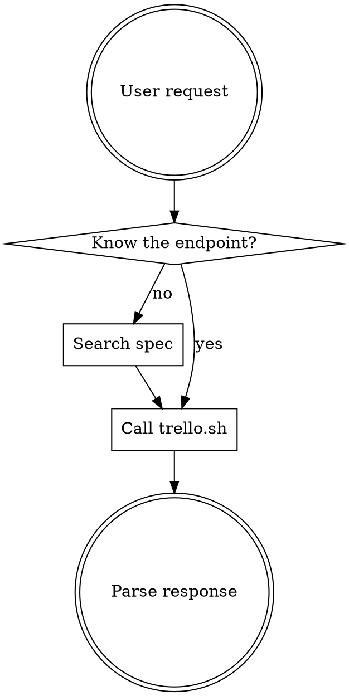

# Trello API

Invoke any of the 256 Trello REST API operations using the `trello.sh` wrapper, with the official OpenAPI spec cached locally and queried via jq.

API calls are auto-approved via the plugin's PreToolUse hook — no manual permission prompts needed.

## Setup

```bash
${CLAUDE_PLUGIN_ROOT}/scripts/spec-manager.sh ensure-spec
```

Run `ensure-spec` once per session. It downloads the spec on first use and checks for updates daily.

## Auth

All requests require env vars `TRELLO_API_KEY` and `TRELLO_TOKEN`. The wrapper appends these automatically — do not add them to calls.

## Workflow



1. Run `ensure-spec` if not already done this session
2. If endpoint is unknown, use jq recipes below to find it
3. Call `trello.sh` with method, path, and params
4. Parse response (wrapper outputs JSON via jq)

## API Calls

Use the wrapper for all Trello API requests:

```bash
${CLAUDE_PLUGIN_ROOT}/scripts/trello.sh <METHOD> <path> [key=value ...]
```

**Examples:**

```bash
# GET
${CLAUDE_PLUGIN_ROOT}/scripts/trello.sh GET /boards/{id}

# GET with query params
${CLAUDE_PLUGIN_ROOT}/scripts/trello.sh GET /boards/{id}/cards filter=open

# POST
${CLAUDE_PLUGIN_ROOT}/scripts/trello.sh POST /cards name=My+Task idList={listId}

# PUT
${CLAUDE_PLUGIN_ROOT}/scripts/trello.sh PUT /cards/{id} name=Updated+Name

# DELETE
${CLAUDE_PLUGIN_ROOT}/scripts/trello.sh DELETE /cards/{id}

# File upload (use =@ prefix for file params)
${CLAUDE_PLUGIN_ROOT}/scripts/trello.sh POST /cards/{id}/attachments file=@/path/to/doc.pdf name=document.pdf
```

The wrapper handles auth, temp files, HTTP error detection, and JSON formatting. Use `+` for spaces in values or URL-encode them.

## Spec Queries

All queries use: `${CLAUDE_PLUGIN_ROOT}/scripts/spec-manager.sh query [jq-args...] '<expression>'`

**List API groups:**
```bash
${CLAUDE_PLUGIN_ROOT}/scripts/spec-manager.sh list-groups
```

**List endpoints for a group:**
```bash
${CLAUDE_PLUGIN_ROOT}/scripts/spec-manager.sh query --arg group "boards" \
  '.paths | to_entries[] | select(.key | startswith("/\($group)")) | .key as $path | .value | to_entries[] | select(.key == "parameters" | not) | {method: (.key | ascii_upcase), path: $path, summary: .value.summary}'
```

**Search by keyword:**
```bash
${CLAUDE_PLUGIN_ROOT}/scripts/spec-manager.sh query --arg kw "webhook" \
  '[.paths | to_entries[] | .key as $path | .value | to_entries[] | select(.key == "parameters" | not) | select((.value.summary // "" | test($kw; "i")) or (.value.description // "" | test($kw; "i"))) | {method: (.key | ascii_upcase), path: $path, summary: .value.summary}]'
```

**Full endpoint details (by operationId):**
```bash
${CLAUDE_PLUGIN_ROOT}/scripts/spec-manager.sh query --arg opId "get-boards-id" \
  '.paths | to_entries[] | .key as $path | .value | (.parameters // []) as $pathParams | to_entries[] | select(.key == "parameters" | not) | select(.value.operationId == $opId) | {path: $path, method: (.key | ascii_upcase), summary: .value.summary, parameters: ($pathParams + (.value.parameters // [])), requestBody: .value.requestBody, responses: .value.responses}'
```

**Get component schema:**
```bash
${CLAUDE_PLUGIN_ROOT}/scripts/spec-manager.sh query --arg name "Card" '.components.schemas[$name]'
```

**Required params for an endpoint:**
```bash
${CLAUDE_PLUGIN_ROOT}/scripts/spec-manager.sh query --arg path "/cards" --arg method "post" \
  '.paths[$path] | (.parameters // []) as $pathParams | .[$method].parameters as $opParams | ($pathParams + ($opParams // [])) | map(select(.required == true)) | map({name, in: .in, description, schema})'
```

## Key Spec Facts

- 256 operations across 18 groups (cards, boards, members, lists, organizations, etc.)
- **Most mutations use query params, not request bodies** (only 10 of 256 use requestBody)
- `operationId` is the unique key (kebab-case: `get-boards-id`, `post-cards`)
- 63 component schemas (Board, Card, TrelloList, Member, Label, etc.)
- Tags are empty in the spec — group by path prefix instead

## Update Spec

Force-refresh the cached OpenAPI spec:

```bash
${CLAUDE_PLUGIN_ROOT}/scripts/spec-manager.sh update-spec
```

Check cache status:

```bash
${CLAUDE_PLUGIN_ROOT}/scripts/spec-manager.sh status
```

## Common Operations

For examples of common operations (boards, cards, lists, labels, search, webhooks), see [REFERENCE.md](REFERENCE.md).

## Common Mistakes

| Mistake | Fix |
|---------|-----|
| Adding auth params manually | The wrapper adds `key=` and `token=` automatically |
| Using raw curl instead of trello.sh | Always use the wrapper — it handles auth, errors, and output |
| Using request body for mutations | Trello uses query params for most mutations, not JSON bodies |
| Not URL-encoding values | Use `+` for spaces in key=value params |
| Looking for tags in spec | Tags are empty; group endpoints by path prefix |
| Missing path-level params | Always merge path-level and operation-level parameters |
